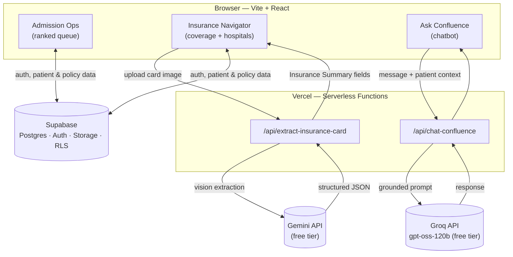
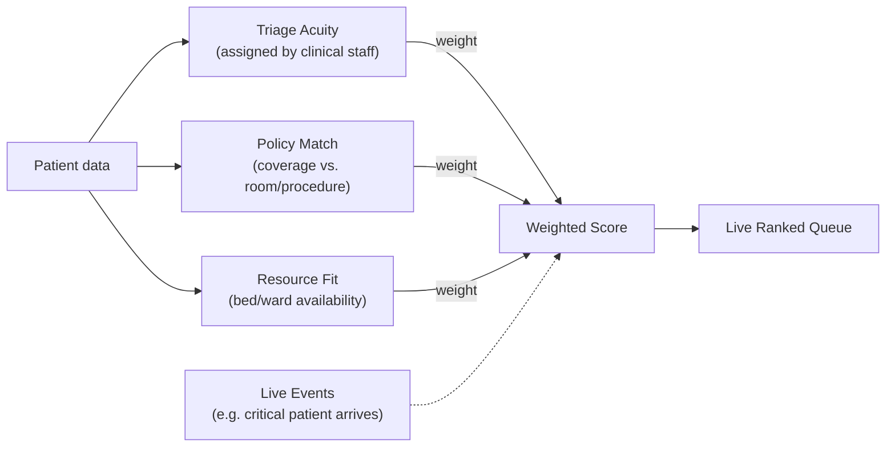

# Confluence

**A holistic optimization system for policy-integrated admission & treatment intelligence.**

Built for the **GE - Precision Care Challenge 2026 (PCC2026)** 

Confluence helps hospitals rank incoming patients by clinical urgency, insurance eligibility, and resource availability in one live view — while giving patients and families a clear, jargon-free picture of their own coverage and care journey.

> ⚠️ Decision-support only. No clinical recommendations, no diagnosis, no binding insurance guarantee — see [Compliance](#compliance) below.

---

## Table of Contents

- [Why this exists](#why-this-exists)
- [Architecture](#architecture)
- [How admission ranking works](#how-admission-ranking-works)
- [Features](#features)
- [Tech stack](#tech-stack)
- [Local setup](#local-setup)
- [Deployment](#deployment)
- [Project structure](#project-structure)
- [Compliance](#compliance)

---

## Why this exists

Hospitals juggle three things every time a patient needs a bed: **how urgent is this**, **what does their insurance actually cover**, and **what resources are free right now**. Today these live in three different systems, checked by three different people, updated at three different speeds.

Confluence puts all three into one live, re-rankable queue — and separately, gives patients a plain-language answer to "what's covered, where, and what happens next."

---

## Architecture



**Why two separate AI providers?** Card extraction (Gemini) and chat (Groq) sit on independent free-tier quotas, so a spike in one never rate-limits the other.

**Why serverless functions, not direct client calls?** API keys never reach the browser bundle — `VITE_`-prefixed env vars are publicly readable, so anything secret is routed through `/api/*`.

---

## How admission ranking works



Weights are adjustable live via the **Optimization Weights** panel, so the queue re-ranks in real time as priorities shift — not a one-time batch calculation.

---

## Features

| Tab | What it does |
|---|---|
| **Admission Ops** | Live-ranked patient queue (Triage Acuity × Policy Match × Resource Fit), adjustable weights, simulated live events, decision-audit visibility |
| **Insurance Navigator** | Upload an insurance card → real AI extraction of Insurer, Policy Type, Coverage Limit, Room Eligibility, Exclusions → matched against in-network hospitals with cost estimates |
| **Ask Confluence** | Chatbot grounded in the *currently selected patient's* actual coverage and hospital data — no invented numbers, no clinical advice |
| **Patient View** | Simplified, single-patient toggle on Admission Ops — hides internal scoring, shows plain-language status |
| **Multi-language** | English, Tamil, Hindi, Kannada, Telugu, Malayalam |

---

## Tech stack

- **Frontend:** Vite + React
- **Backend / DB:** Supabase (Postgres, Auth, Storage, RLS)
- **Hosting:** Vercel (Serverless Functions for all secret-key calls)
- **Card extraction:** Gemini API (free tier)
- **Chatbot:** Groq API, `gpt-oss-120b` (free tier)
- **Deck generation:** pptxgenjs

---

## Local setup

```bash
git clone https://github.com/Madhi2728/confluence-app.git
cd confluence-app
npm install
```

Create `.env` in the project root:

```
VITE_SUPABASE_URL=your-supabase-url
VITE_SUPABASE_ANON_KEY=your-supabase-anon-key
GEMINI_API_KEY=your-gemini-key
GROQ_API_KEY=your-groq-key
```

**Two ways to run it:**

```bash
npm run dev          # frontend only — fast iteration, /api/* routes will NOT work
npm run dev:vercel   # full stack via Vercel CLI — required to test card upload or chatbot
```

> `npm run dev` alone will show a "couldn't reach the extraction service" fallback for any AI feature — that's expected, not a bug. Use `dev:vercel` whenever you need the real pipeline.

---

## Deployment

```bash
vercel link          # first time only — links this folder to a Vercel project
vercel env add GEMINI_API_KEY
vercel env add GROQ_API_KEY
vercel env add VITE_SUPABASE_URL
vercel env add VITE_SUPABASE_ANON_KEY

vercel               # preview deployment — test before going live
vercel --prod        # production deployment
```

Function timeout is set to 60s (`vercel.json`) for the extraction endpoint, since Gemini vision calls can take longer than Vercel's 10s default.

---

## Project structure

```
confluence-app/
├── api/
│   ├── extract-insurance-card.js   # Gemini vision extraction
│   └── chat-confluence.js          # Groq-powered chatbot
├── src/
│   └── ConfluenceDashboard.jsx     # main app component
├── test/
│   ├── api/                        # endpoint tests
│   └── fixtures/insurance-cards/   # synthetic test data
├── vercel.json
└── .env.example
```

---

## Compliance

This tool is **decision-support only** — a hard constraint from the competition brief:

- No clinical recommendations, anywhere in the UI or chatbot output
- "Clinical Risk" is labeled **Triage Acuity (assigned by clinical staff)** — the system never claims to assess urgency itself
- Every insurance/coverage statement carries a "not a binding guarantee" disclaimer
- The chatbot answers only from the data it's given (current patient's actual coverage + hospital data) — it declines rather than guesses, and only computes arithmetic when both numbers are already provided

---

**Team: MediSense** (Team Members - Jayamathi.P , Sree Charu Latha.R) 
